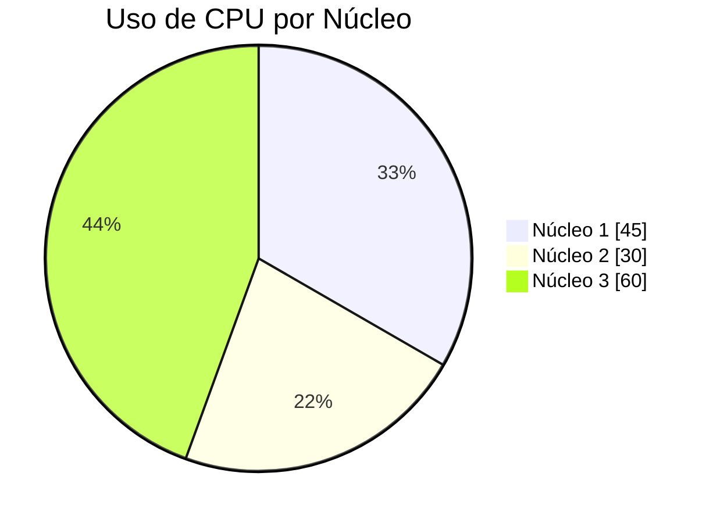

# 🖥️ OpsLinux – Monitoramento Inteligente de Recursos Linux

OpsLinux é um sistema completo para monitoramento de recursos Linux, desenvolvido em **Python + Flask**, com integração de **IA Gemini (Google)**.  
Ele expõe uma API REST para obter informações detalhadas sobre **CPU, memória, discos, rede, processos e uptime**, além de utilizar dois agentes inteligentes para interpretar perguntas e gerar respostas claras e visuais.


---

## 📚 Sumário

- [✨ Funcionalidades](#-funcionalidades)
- [🤖 Agentes de IA](#-agentes-de-ia)
- [📌 Pré-requisitos](#-pré-requisitos)
- [🔑 Como gerar a API Key do Gemini](#-como-gerar-a-api-key-do-gemini)
- [🔐 Criando o arquivo env](#-criando-o-arquivo-env)
- [🛠️ Instalação](#️-instalação)
- [▶️ Executando o servidor](#️-executando-o-servidor)
- [📈 Exemplo de interação](#-exemplo-de-interação)
- [👥 Desenvolvedores](#-desenvolvedores)

---

## ✨ Funcionalidades

OpsLinux fornece múltiplos endpoints para monitoramento do sistema:

### 🔥 CPU
- Uso por núcleo  
- Frequência  
- Tempos de execução  
- Temperatura  

### 💾 Memória
- RAM total, usada e livre  
- Swap  
- Porcentagem de uso  

### 📀 Disco
- Partições  
- Espaço total / usado / livre  
- Estatísticas de I/O  

### 🌐 Rede
- Interfaces disponíveis  
- Endereços IP  
- Tráfego enviado e recebido  
- Status da interface  

### 📋 Processos
- PID  
- Nome  
- Usuário  
- Uso de CPU e memória  
- Tempo de execução  

### ⏱️ Uptime
- Tempo total desde o último boot  

### 🧩 System Info
- Uptime  
- CPU  
- Memória  
- Disco  
- Endereço IP  

---

## 🤖 Agentes de IA

### 🔧 **docBot**
Interpreta perguntas em linguagem natural e identifica automaticamente qual endpoint da API consultar.

### 💻 **SysBot**
Recebe os dados do endpoint solicitado e os transforma em uma explicação clara, resumida e amigável.  
Também gera diagramas em **Mermaid.js** para visualização.

---

## 📌 Pré-requisitos

- Python 3.x  
- Flask  
- psutil  
- **Conta Google e chave da API Gemini**

---

## 🔑 Como gerar a API Key do Gemini

1. Acesse:  
   👉 https://aistudio.google.com/

2. Faça login com sua conta Google.

3. No menu lateral, clique em **"API Keys"**.

4. Clique em **"Create API Key"**.

5. Copie a chave gerada — ela será usada no `.env`.

---

## 🔐 Criando o arquivo `.env`

Na raiz do projeto, crie um arquivo chamado **`.env`**:

```bash
GOOGLE_API_KEY=SUA_CHAVE_AQUI
```


Sem esse arquivo, a integração com IA **não funciona**.

---

## 🛠️ Instalação

```bash
git clone https://github.com/michelleGomes85/OpsLinux.git
cd OpsLinux
pip install -r requirements.txt
```

## ▶️ Executando o servidor

```bash
python app.py
```

Acesse no navegador ou em clientes HTTP:

```bash
http://localhost:5002/
```

## 📈 Exemplo de interação

Usuário:

> Como está o uso da CPU agora?

docBot:

Identifica que precisa consultar o endpoint `/cpu`.

SysBot:

Retorna a interpretação:

> “Núcleo 1: 45%, Núcleo 2: 30%, Núcleo 3: 60%...”

E pode retornar algo como:


---

## 👥 Desenvolvedores

[](https://github.com/michelleGomes85)  
[](https://github.com/GabrielBarbosaAfo)
